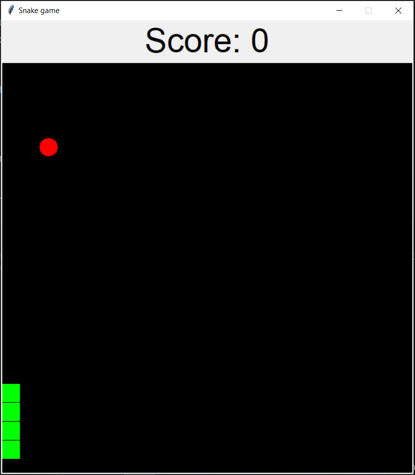

# Snake game by using python with tkinter
## An interactive snake game with score

### - Use of tkinter.
### - Can use up arrow,down arrow,left arrow and right arrow as movements for the snake.
### - An apple appears randomly inside the interface or window.
### - When you get the apple, the apple automatically disappear and the score is updated automatically and the snake length is increased.
### - Cannot touch walls and if touched the screen automatically shows game over and no more movement or actions can be done.
### - Can easily change the speed and initial length of the snake by changing only a number within code.
### - Very dynamic and easy to play.
